##Retail-Sales-Data-Quality-Preparation

Retail sales EDA | SQL (data cleaning & prep)

##🛠️ Tools Used
SQL Server (SSMS) — data cleaning & analysis
##📁 Data
Raw data located in `/data/raw/`.
Files provided by mentor for educational purposes only.
##📂 Data Sources
Raw data files provided by mentor for educational purposes only.
File	Description
`inventory.csv`	Inventory data
`products.csv`	Products data
`sales_orders.csv`	Sales orders data
##📊 Project Steps
Data quality check
Data cleaning (SQL)
Data preparation
##🗂️ SQL Scripts
`sql/00_data_import.sql` — initial data import and table setup
`sql/01_data_quality.sql` — data quality check for all three tables
`sql/02_data_cleaning.sql` — data cleaning and standardization
`sql/03_data_preparation.sql` — views and final data preparation for analysis

Data Quality Report
This dataset covers retail clothing sales across Europe (including Poland, France, Austria, Italy, Germany, and other countries) from 2015 to 2024. The data was provided by my mentor and is synthetic, for educational purposes — it does not come from a real store.
DATA QUALITY ANALYSIS FOR TABLES: SALES_ORDERS, PRODUCTS, AND INVENTORY
First, I wanted to check how large the datasets I'm working with are. If I remove any rows later on, this will let me easily verify that the operation worked correctly, by subtracting the number of removed rows from the original row count. So, for each table, I counted the number of rows with the following queries:
```sql
SELECT COUNT (*) AS total_rows 
FROM sales_orders;

SELECT COUNT (*) AS total_rows 
FROM inventory_mmmgkubv; 

SELECT COUNT (*) AS total_rows 
FROM products_mmmgmeum; 
```
For each table, this is:
sales_orders - 260,780 rows
inventory_mmmgkubv – 3,741 rows
products_mmmgmeum - 2,500 rows
Next, I did an initial review of the sales_orders table.
ANALYSIS OF THE SALES_ORDERS TABLE
First, I wanted to see the structure of the sales_orders table.
I did this with the following query:
```sql
SELECT TOP 5 *
FROM sales_orders;
```
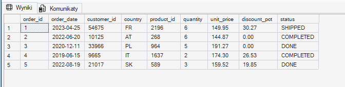
Screen 1: Structure of the sales_orders table
As shown, the table consists of 9 columns, containing text, numeric, and date data.
Next, I decided to check how many null values are in this table, using the following query:
```sql
SELECT COUNT (*) AS total_rows,
	SUM(CASE WHEN order_id IS NULL THEN 1 ELSE 0 END) AS null_order_id,
	SUM(CASE WHEN order_date IS NULL THEN 1 ELSE 0 END) AS null_order_date,
	SUM(CASE WHEN customer_id IS NULL THEN 1 ELSE 0 END) AS null_customer_id,
	SUM(CASE WHEN country IS NULL THEN 1 ELSE 0 END) AS null_country,
	SUM(CASE WHEN product_id IS NULL THEN 1 ELSE 0 END) AS null_product_id,
	SUM(CASE WHEN quantity IS NULL THEN 1 ELSE 0 END)AS null_quantity,
	SUM(CASE WHEN unit_price IS NULL THEN 1 ELSE 0 END) AS null_quantity,
	SUM(CASE WHEN discount_pct IS NULL THEN 1 ELSE 0 END) AS null_discount_pct,
	SUM(CASE WHEN status IS NULL THEN 1 ELSE 0 END) AS null_status
FROM sales_orders;
```
Null values occurred in the order_date and discount_pct columns. For order_date there are 629 such values, which is 0.2%, while for discount_pct there are as many as 31,322 values, or 12%. For discount_pct, the missing values most likely indicate that no discount was applied — still, these gaps are worth investigating further during data cleaning.
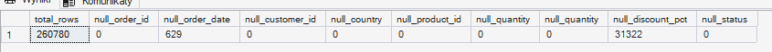
Screen 2: Null values in the relevant columns
Next, I decided to check whether there are duplicates in individual columns of the table.
First, I checked the order_id column with the following query:
```sql
SELECT COUNT(*) AS total_rows,
	COUNT(DISTINCT order_id) AS unique_orders
FROM sales_orders;
```
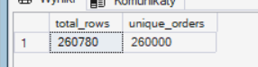
Screen 3: total rows vs. unique rows in the order_id column
As shown above, there are 260,780 rows in total, while the number of unique values is 260,000, which shows we have 780 duplicates. I want to check what these duplicates look like, and possibly decide what to do with them during data cleaning. I used the following query for this.
```sql
SELECT order_id, COUNT(*) AS quantity_duplicates
FROM sales_orders
GROUP BY order_id
HAVING COUNT(*)>1;
```
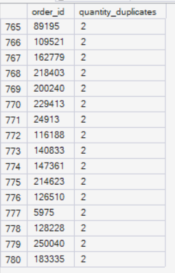
Screen 4: duplicated order_id values
As shown above, all 780 duplicated order_id values appear exactly twice. This was most likely a system error that read the orders in twice. It's worth reporting this to the team responsible for data collection, so they can check whether this error can be prevented in the future, and monitor whether it recurs in the next analysis of data from this store. Given that duplicates account for only 0.3% of all rows, I think I can already recommend removing these rows at this stage, since a gap of this size has no impact on a reliable analysis.
Next, I checked for duplicates in the status column. I used the following query:
```sql
SELECT COUNT(*) AS total_rows,
COUNT(DISTINCT status) AS unique_status
FROM sales_orders;
```
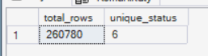
Screen 5: total rows vs. unique rows in the status column
As shown, we have only 6 unique values out of 260,780 rows. These are presumably the names of individual statuses. So my next step is to check these names and verify their correctness.
```sql
SELECT status, COUNT(*) AS name_duplicates
FROM sales_orders
GROUP BY status
```
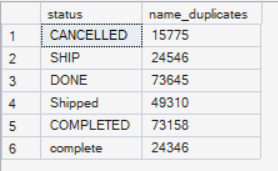
Screen 6: status names and the number of rows for each status
As shown in the screenshot above, we have 6 different statuses. It's worth noting that some of them mean the same thing but are written in upper or lower case, or use synonyms, such as COMPLITE vs. Complete, or SHIP vs. Shipped. For the analysis, the status naming needs to be standardized, and the standardized names should also be passed on to the data collection team so they can unify them for any future analyses.
Next, I checked for duplicates in the country column
```sql
SELECT COUNT(*) AS total_rows,
COUNT(DISTINCT country) AS unique_status
FROM sales_orders;
```
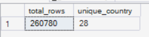
Screen 7: total rows vs. unique rows in the country column
As shown in the screenshot above, our table contains 28 countries. Now I'll check their names and how many records there are for each country.
```sql
SELECT country, COUNT(*) AS name_duplicates
FROM sales_orders
GROUP BY country
```
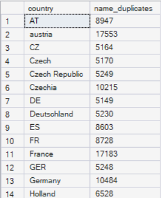
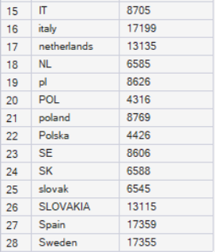
Screen 8: Country names and how often they appear in the table
As shown in screen 8, we have 28 rows, but we can also see that the naming is inconsistent. We have CZ, Czech, Czech Republic, and Czechia — and it's practically the same story for most other countries. For the analysis, the country names need to be standardized, and the standardized names should also be passed on to the data collection team so they can unify them for any future analyses.
Next, I decided to check the quantity and unit_price columns to see whether there were any erroneous values, such as negative numbers or unusually high product prices.
```sql
SELECT
	MAX (quantity) AS max_value,
	MIN (quantity) AS min_value,
	MAX (unit_price) AS max_unite_price,
	MIN (unit_price) AS min_unite_price
FROM sales_orders
WHERE quantity IS NOT NULL AND unit_price IS NOT NULL
```
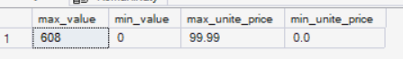
Screen 9: minimum and maximum values for the quantity and price columns
In the query above, I added an extra condition so the result would exclude null values. Without this condition the result would have been the same, since we already checked (screen 2) that there are no null values in these columns. Still, I added this condition as "good practice", to make sure that if such a value did exist, it wouldn't affect the result. Based on the results above, it's worth additionally verifying the minimum values in the quantity and price columns. A value of 0 for price or quantity may indicate a cancelled order, a free item added to an order, or a return/complaint. To verify this further, I'm checking whether the 0 values in both columns correlate with the cancelled status.
```sql
SELECT quantity,status
FROM sales_orders
WHERE quantity=0;	
```
```sql
SELECT unit_price, status
FROM sales_orders
WHERE CAST(unit_price AS decimal(10,2)) = 0
```
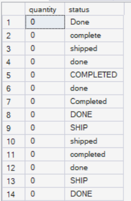
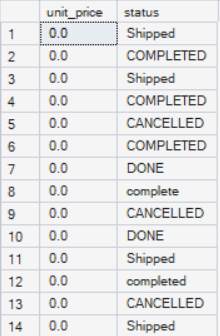
Screen 10: Statuses associated with quantity=0 and unit_price=0.0
As shown above, I checked what the statuses look like for the value 0. Additionally, for unit_price I used the condition WHERE CAST(unit_price AS decimal(10,2)) = 0, since unit_price is stored as text and I wanted to make sure the comparison to a number would work correctly and predictably.
As for the data, we can see that the 0 values are associated with various statuses. An obvious data error is, for example, quantity 0 with a status of complete or done — similarly, we wouldn't expect statuses like Completed or shipped to have a price of 0. This data will be examined more closely during data cleaning. It's worth checking whether there's a visible correlation or these are simply errors, and deciding whether they should be removed or kept.
Next, I checked the date formats in the order_date column.
```sql
SELECT DISTINCT 
 LEFT(order_date, 5) AS first_4_signs,
 LEN(order_date) AS lenght,
 COUNT(*) AS liczba
FROM sales_orders
WHERE order_date IS NOT NULL
GROUP BY LEFT(order_date, 5), LEN(order_date)
ORDER BY liczba DESC
```
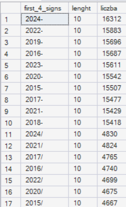
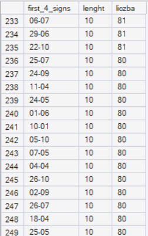
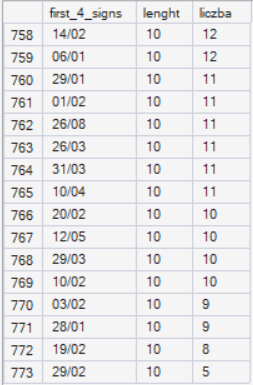
Screen 11: Date formats
As shown above, we have several date formats. The most common are YYYY-MM-DD and YYYY/MM/DD, followed by, for example, DD-MM-YYYY and MM/DD/YYYY. It's worth standardizing the dates to a single format. I think the most sensible choice would be YYYY-MM-DD, since it occurs most frequently.
Next, I decided to check whether there were any other errors in the dates, such as incomplete dates.
```sql
SELECT DISTINCT order_date
FROM sales_orders
WHERE TRY_CAST(order_date AS date) IS NULL
AND order_date IS NOT NULL
AND order_date NOT LIKE '__/__/____'
AND order_date NOT LIKE '____-__-__'
AND order_date NOT LIKE '__-__-____';
```
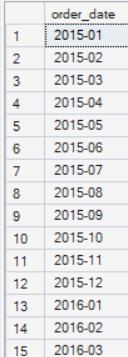
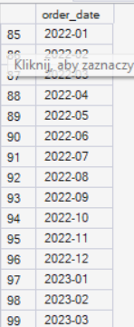
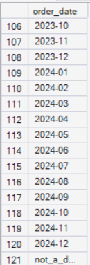
Screen 12: other invalid dates
As we can see in screen 12, the table contains dates without a day and entries marked not_a_date. These cases also need to be analyzed further to decide whether to remove or fill them in.
ANALYSIS OF THE PRODUCTS TABLE
As before, I first wanted to see the structure of the table.
```sql
SELECT TOP 5 *
FROM products_mmmgmeum;
```
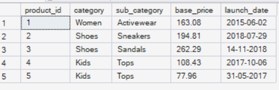
Screen 13: Structure of the products table
As shown, the table has 5 columns and also contains text, numeric, and date data.
As before, I first wanted to check how many null values are in the table.
```sql
SELECT COUNT (*) AS total_rows, 
SUM(CASE WHEN product_id IS NULL THEN 1 ELSE 0 END) AS null_product_id,
SUM(CASE WHEN category IS NULL THEN 1 ELSE 0 END) AS null_category,
SUM(CASE WHEN sub_category IS NULL THEN 1 ELSE 0 END) AS null_sub_category,
SUM(CASE WHEN base_price IS NULL THEN 1 ELSE 0 END) AS base_price,
SUM(CASE WHEN launch_date IS NULL THEN 1 ELSE 0 END) AS launch_date
FROM products_mmmgmeum; 
```
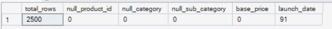
Screen 14: Null values in the products table
As shown in screen 14, null values occur only in the launch_date column, with 91 such values — 3.64% of the whole dataset. That's a fairly small percentage, so it shouldn't negatively affect the analysis. I'll decide what to do with this data during data cleaning.
Next, I started checking for duplicates in individual columns, beginning with product_id.
```sql
SELECT 
	COUNT(*) as all_rows,
	COUNT(DISTINCT product_id) AS unique_product_id
FROM products_mmmgmeum; 
```
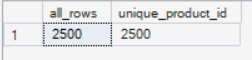
Screen 15: Unique values in the product_id column
As shown in the screenshot above, the product_id column has no duplicates.
Next, I wanted to check whether the names in the category column are consistent.
```sql
SELECT category, COUNT(*) AS all_rows
FROM products_mmmgmeum
GROUP BY ROLLUP(category)
ORDER BY all_rows
FROM products_mmmgmeum; 
```
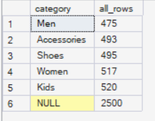
Screen 16: Categories in the category column
As shown above, we have 5 categories. Their naming is consistent, and every row has a category assigned.
Next, I checked the sub_category column.
```sql
SELECT sub_category, COUNT(*) AS all_rows
FROM products_mmmgmeum
GROUP BY ROLLUP (sub_category)
ORDER BY all_rows;
```
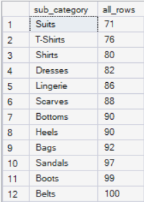
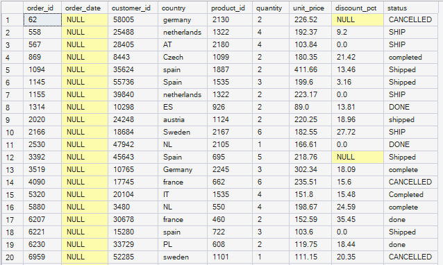
Screen 17: Subcategories in the sub_category column
As shown in the screenshot above, we have 22 subcategories — their naming is also consistent, and every row has a subcategory assigned.
Next, I checked the base_price column. First, I checked whether there was any price below 0.01.
```sql
SELECT base_price
FROM products_mmmgmeum
WHERE CAST(base_price AS decimal(10,2)) < 0.01;
```
In this query, I also used the condition WHERE CAST(base_price AS decimal(10,2)) < 0.01, since the input data for this column is nvarchar(50), and I wanted to make sure the comparison to a number would work correctly and predictably. The result showed that there is no value below 0.01 in the base_price column. So I also wanted to check what the lowest and highest base price in this column were.
```sql
SELECT 
	MIN(CAST(base_price AS decimal(10,2))) AS min_price,
	MAX(CAST(base_price AS decimal(10,2))) AS max_price
FROM products_mmmgmeum;
```
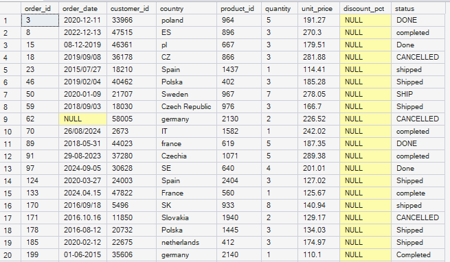
Screen 18: Minimum and maximum price in the base_price column
Neither the minimum nor the maximum price raised any concerns, so I assume the data in this column is correct.
The last column in this table is launch_date. We know it contains 91 null values — let's check whether it also contains any date formats other than the ones we expect.
```sql
SELECT DISTINCT launch_date
FROM products_mmmgmeum
WHERE TRY_CAST(launch_date AS date) IS NULL
AND launch_date IS NOT NULL
AND launch_date NOT LIKE '__/__/____'
AND launch_date NOT LIKE '____-__-__'
AND launch_date NOT LIKE '__-__-____';
```
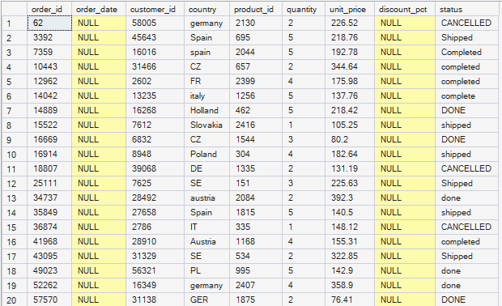
Screen 19: Non-standard dates in the launch_date column
Besides null values, this column also contains dates without a day and entries with the text not_a_date. This is something to resolve during data cleaning — whether to fill in these dates randomly or remove them.
ANALYSIS OF THE INVENTORY TABLE
First, I check the structure of the inventory table
```sql
SELECT TOP 5 *
FROM inventory_mmmgkubv;
```
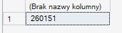
Screen 20: Structure of the inventory table
The table has 4 columns. It contains text, numeric, and date data.
The null values for this table are as follows:
```sql
SELECT COUNT (*) AS total_rows, 
SUM(CASE WHEN product_id IS NULL THEN 1 ELSE 0 END) AS null_product_id,
SUM(CASE WHEN warehouse_country IS NULL THEN 1 ELSE 0 END) AS null_warehouse_country,
SUM(CASE WHEN stock_quantity IS NULL THEN 1 ELSE 0 END) AS null_stock_quantity,
SUM(CASE WHEN last_stock_update IS NULL THEN 1 ELSE 0 END) AS last_stock_update
FROM inventory_mmmgkubv; 
```
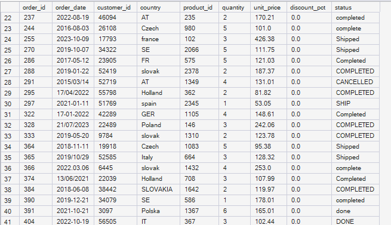
Screen 21: Null values in the inventory table
We have 26 empty values in the last_stock_update column, which is 0.7% of all the data. What to do with this will be decided during data cleaning.
Next, I checked whether the product_id column contains any ID<0, which could suggest a data error.
```sql
SELECT product_id
FROM inventory_mmmgkubv
WHERE product_id<0;
```
It turned out there were no such results. I also checked whether the product_id column contains any non-numeric values — I didn't find any of those either. So the data in this column is correct.
```sql
SELECT product_id
FROM inventory_mmmgkubv
WHERE TRY_CAST(product_id AS NUMERIC) IS NULL;
```
Next, I checked what unique values we have in the warehouse_country column and whether there were any duplicates.
```sql
SELECT DISTINCT warehouse_country
FROM inventory_mmmgkubv;
```
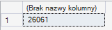
Screen 22: Unique values in the warehouse_country column
Just as with the country column in the sales_orders table, here too we have inconsistent country naming. For example, we have both DE and Germany. For the analysis, the country names need to be standardized, and the standardized names should also be passed on to the data collection team so they can unify them for any future analyses.
Next, I checked the stock_quantity column for any values below 0, which would suggest errors in the data
```sql
SELECT stock_quantity
FROM inventory_mmmgkubv
WHERE stock_quantity<0;
```
The query result showed that no such values exist.
Finally, I also checked the date formats in the last_stock_update column.
```sql
SELECT DISTINCT last_stock_update
FROM inventory_mmmgkubv
WHERE TRY_CAST( last_stock_update AS date) IS NULL
AND last_stock_update IS NOT NULL
AND last_stock_update LIKE '____-__-__'
AND last_stock_update LIKE '__-__-____'
AND last_stock_update LIKE '____/__/__'
AND last_stock_update LIKE '__/__/____';
```
The query showed no non-standard date formats in the table. So I decided to check what kinds of dates we're actually dealing with.
```sql
SELECT DISTINCT last_stock_update
FROM inventory_mmmgkubv;
```
It turned out that all dates are in the YYYY-MM-DD format, as shown in the screenshot below
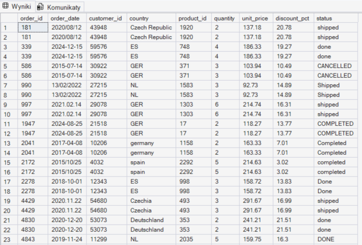
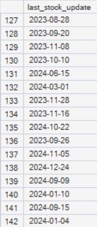
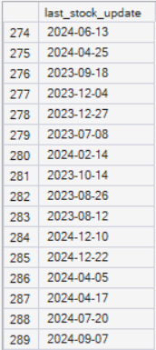
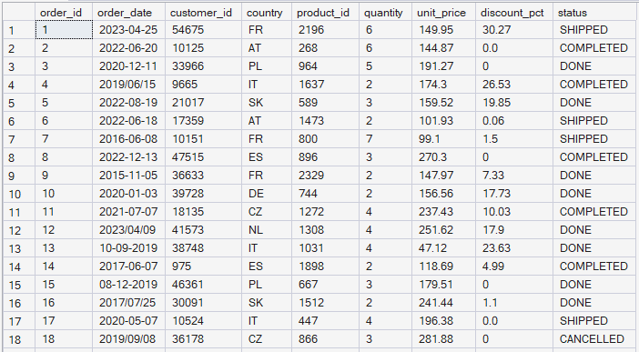
Screen 23: Date formats in the last_stock_update column
Summary
The analysis covered three tables (sales_orders, products, inventory) for duplicates, null values, inconsistent naming, and non-standard date formats. The main data quality issues are: 780 duplicated orders in sales_orders (0.3% of rows, recommended for removal), inconsistent order status and country names in both tables (sales_orders and inventory) that need standardizing, several date formats in the order_date, launch_date, and last_stock_update columns (to be unified to YYYY-MM-DD), and zero values in quantity and unit_price that need further verification for a possible correlation with order status. Missing data (nulls) occurs at a low rate and, in most cases, shouldn't significantly affect the further analysis. The findings from this stage will form the basis for decisions made during data cleaning.
