# Retail-Sales-Data-Quality-Preparation

Retail sales EDA | SQL (data cleaning &amp; prep) 

## 🛠️ Tools Used

- SQL Server (SSMS) - data cleaning & analysis

## 📁 Data

Raw data located in `/data/raw/`.
Files provided by my mentor for educational purposes only.

## 📂 Data Sources

Raw data files provided by my mentor for educational purposes only.

| File | Description |
|------|-------------|
| `inventory.csv` | Inventory data |
| `products.csv` | Products data |
| `sales_orders.csv` | Sales orders data |

## 📊 Project Steps

1. Data quality check
2. Data cleaning (SQL)
3. Data preparation

## 🗂️ SQL Scripts

- `sql/00_data_import.sql` - initial data import and table setup
- `sql/01_data_quality.sql` - data quality check for all three tables
- `sql/02_data_cleaning.sql` - data cleaning and standardization
- `sql/03_data_preparation.sql` - views and final data preparation for analysis


## Data Quality Report

This dataset covers retail clothing sales across Europe (including Poland, France, Austria, Italy, Germany, and other countries) from 2015 to 2024. The data was provided by my mentor and is synthetic, for educational purposes, it does not come from a real store.

### DATA QUALITY ANALYSIS FOR TABLES: SALES_ORDERS, PRODUCTS, AND INVENTORY

First, I wanted to check how large the datasets I'm working with are. If I remove any rows later on, this will let me easily verify that the operation worked correctly, by subtracting the number of removed rows from the original row count. So, for each table, I counted the number of rows with the following queries:

```sql
SELECT COUNT (*) AS total_rows 
FROM sales_orders;

SELECT COUNT (*) AS total_rows 
FROM inventory_mmmgkubv; 

SELECT COUNT (*) AS total_rows 
FROM products_mmmgmeum; 
```

For each table, this is:

- sales_orders - 260,780 rows

- inventory_mmmgkubv – 3,741 rows

- products_mmmgmeum - 2,500 rows

Next, I did an initial review of the sales_orders table.

### ANALYSIS OF THE SALES_ORDERS TABLE

First, I wanted to see the structure of the sales_orders table.
I did this with the following query:

```sql
SELECT TOP 5 *
FROM sales_orders;
```


**_Screen 1: Structure of the sales_orders table_**

As shown, the table consists of 9 columns, containing text, numeric, and date data.

Next, I decided to check how many null values are in this table, using the following query:

```sql
SELECT COUNT (*) AS total_rows,
	SUM(CASE WHEN order_id IS NULL THEN 1 ELSE 0 END) AS null_order_id,
	SUM(CASE WHEN order_date IS NULL THEN 1 ELSE 0 END) AS null_order_date,
	SUM(CASE WHEN customer_id IS NULL THEN 1 ELSE 0 END) AS null_customer_id,
	SUM(CASE WHEN country IS NULL THEN 1 ELSE 0 END) AS null_country,
	SUM(CASE WHEN product_id IS NULL THEN 1 ELSE 0 END) AS null_product_id,
	SUM(CASE WHEN quantity IS NULL THEN 1 ELSE 0 END)AS null_quantity,
	SUM(CASE WHEN unit_price IS NULL THEN 1 ELSE 0 END) AS null_quantity,
	SUM(CASE WHEN discount_pct IS NULL THEN 1 ELSE 0 END) AS null_discount_pct,
	SUM(CASE WHEN status IS NULL THEN 1 ELSE 0 END) AS null_status
FROM sales_orders;
```

Null values occurred in the order_date and discount_pct columns. For order_date there are 629 such values, which is 0.2%, while for discount_pct there are as many as 31,322 values, or 12%. For discount_pct, the missing values most likely indicate that no discount was applied. Still, these gaps are worth investigating further during data cleaning.


**_Screen 2: Null values in the relevant columns_**

Next, I decided to check whether there are duplicates in individual columns of the table.

First, I checked the order_id column with the following query:

```sql
SELECT COUNT(*) AS total_rows,
	COUNT(DISTINCT order_id) AS unique_orders
FROM sales_orders;
```


**_Screen 3: total rows vs. unique rows in the order_id column_**

As shown above, there are 260,780 rows in total, while the number of unique values is 260,000, which shows we have 780 duplicates. I wanted to check what these duplicates look like, and possibly decide what to do with them during data cleaning. I used the following query for this.

```sql
SELECT order_id, COUNT(*) AS quantity_duplicates
FROM sales_orders
GROUP BY order_id
HAVING COUNT(*)>1;
```


**_Screen 4: duplicated order_id values_**

As shown above, all 780 duplicated order_id values appear exactly twice. This was most likely a system error that duplicated the orders. It's worth reporting this to the team responsible for data collection, so they can check whether this error can be prevented in the future, and monitor whether it recurs in the next analysis of data from this store. Given that duplicates account for only 0.3% of all rows, I think I can already recommend removing these rows at this stage, since a gap of this size has no impact on a reliable analysis.

Next, I checked for duplicates in the status column. I used the following query:

```sql
SELECT COUNT(*) AS total_rows,
COUNT(DISTINCT status) AS unique_status
FROM sales_orders;
```


**_Screen 5: total rows vs. unique rows in the status column_**

As shown, we have only 6 unique values out of 260,780 rows. These are presumably the names of individual statuses. So my next step is to check these names and verify their correctness.

```sql
SELECT status, COUNT(*) AS name_duplicates
FROM sales_orders
GROUP BY status
```


**_Screen 6: status names and the number of rows for each status_**

As shown in the screenshot above, we have 6 different statuses. It's worth noting that some of them mean the same thing but are written in upper or lower case, or use synonyms, such as COMPLITE vs. Complete, or SHIP vs. Shipped. For the analysis, the status naming needs to be standardized, and the standardized names should also be passed on to the data collection team so they can unify them for any future analyses.

Next, I checked for duplicates in the country column.

```sql
SELECT COUNT(*) AS total_rows,
COUNT(DISTINCT country) AS unique_status
FROM sales_orders;
```


**_Screen 7: total rows vs. unique rows in the country column_**

As shown in the screenshot above, our table contains 28 countries. I checked their names and how many records there are for each country.

```sql
SELECT country, COUNT(*) AS name_duplicates
FROM sales_orders
GROUP BY country
```


**_Screen 8: Country names and how often they appear in the table_**

As shown in screen 8, we have 28 rows, but we can also see that the naming is inconsistent. We have CZ, Czech, Czech Republic, and Czechia and it's practically the same story for most other countries. For the analysis, the country names need to be standardized, and the standardized names should also be passed on to the data collection team so they can unify them for any future analyses.

Next, I decided to check the quantity and unit_price columns to see whether there were any erroneous values, such as negative numbers or unusually high product prices.

```sql
SELECT
	MAX (quantity) AS max_value,
	MIN (quantity) AS min_value,
	MAX (unit_price) AS max_unite_price,
	MIN (unit_price) AS min_unite_price
FROM sales_orders
WHERE quantity IS NOT NULL AND unit_price IS NOT NULL
```


**_Screen 9: minimum and maximum values for the quantity and price columns_**

In the query above, I added an extra condition so the result would exclude null values. Without this condition the result would have been the same, since we already checked (screen 2) that there are no null values in these columns. Still, I added this condition as "good practice", to make sure that if such a value did exist, it wouldn't affect the result. Based on the results above, it's worth additionally verifying the minimum values in the quantity and price columns. A value of 0 for price or quantity may indicate a cancelled order, a free item added to an order, or a return/complaint. To verify this further, I checked whether the 0 values in both columns correlate with the cancelled status.

```sql
SELECT quantity,status
FROM sales_orders
WHERE quantity=0;	
```

```sql
SELECT unit_price, status
FROM sales_orders
WHERE CAST(unit_price AS decimal(10,2)) = 0
```


**_Screen 10: Statuses associated with quantity=0 and unit_price=0.0_**

As shown above, I checked what the statuses look like for the value 0. Additionally, for unit_price I used the condition WHERE CAST(unit_price AS decimal(10,2)) = 0, since unit_price is stored as text and I wanted to make sure the comparison to a number would work correctly and predictably.
As for the data, we can see that the 0 values are associated with various statuses. An obvious data error is, for example, quantity 0 with a status of Complete or Done. Similarly, we wouldn't expect statuses like Completed or Shipped to have a price of 0. This data will be examined more closely during data cleaning. It's worth checking whether there's a visible correlation or these are simply errors, and deciding whether they should be removed or kept.

Next, I checked the date formats in the order_date column.

```sql
SELECT DISTINCT 
 LEFT(order_date, 5) AS first_4_signs,
 LEN(order_date) AS lenght,
 COUNT(*) AS liczba
FROM sales_orders
WHERE order_date IS NOT NULL
GROUP BY LEFT(order_date, 5), LEN(order_date)
ORDER BY liczba DESC
```


**_Screen 11: Date formats_**

As shown above, we have several date formats. The most common are YYYY-MM-DD and YYYY/MM/DD, followed by, for example, DD-MM-YYYY and MM/DD/YYYY. It's worth standardizing the dates to a single format. I think the most sensible choice would be YYYY-MM-DD, since it occurs most frequently.

Next, I decided to check whether there were any other errors in the dates, such as incomplete dates.

```sql
SELECT DISTINCT order_date
FROM sales_orders
WHERE TRY_CAST(order_date AS date) IS NULL
AND order_date IS NOT NULL
AND order_date NOT LIKE '__/__/____'
AND order_date NOT LIKE '____-__-__'
AND order_date NOT LIKE '__-__-____';
```


**_Screen 12: other invalid dates_**

As we can see in screen 12, the table contains dates without a day and entries marked not_a_date. These cases also need to be analyzed further to decide whether to remove or fill them in.

### ANALYSIS OF THE PRODUCTS TABLE

As before, I first wanted to see the structure of the table.

```sql
SELECT TOP 5 *
FROM products_mmmgmeum;
```


**_Screen 13: Structure of the products table_**

As shown, the table has 5 columns and also contains text, numeric, and date data.

As before, I first wanted to check how many null values are in the table.

```sql
SELECT COUNT (*) AS total_rows, 
SUM(CASE WHEN product_id IS NULL THEN 1 ELSE 0 END) AS null_product_id,
SUM(CASE WHEN category IS NULL THEN 1 ELSE 0 END) AS null_category,
SUM(CASE WHEN sub_category IS NULL THEN 1 ELSE 0 END) AS null_sub_category,
SUM(CASE WHEN base_price IS NULL THEN 1 ELSE 0 END) AS base_price,
SUM(CASE WHEN launch_date IS NULL THEN 1 ELSE 0 END) AS launch_date
FROM products_mmmgmeum; 
```


**_Screen 14: Null values in the products table_**

As shown in screen 14, null values occur only in the launch_date column, with 91 such values: 3.64% of the whole dataset. That's a fairly small percentage, so it shouldn't negatively affect the analysis. I'll decide what to do with this data during data cleaning.

Next, I started checking for duplicates in individual columns, beginning with product_id.

```sql
SELECT 
	COUNT(*) as all_rows,
	COUNT(DISTINCT product_id) AS unique_product_id
FROM products_mmmgmeum; 
```


**_Screen 15: Unique values in the product_id column_**

As shown in the screenshot above, the product_id column has no duplicates.

Next, I wanted to check whether the names in the category column are consistent.

```sql
SELECT category, COUNT(*) AS all_rows
FROM products_mmmgmeum
GROUP BY ROLLUP(category)
ORDER BY all_rows;
 
```


**_Screen 16: Categories in the category column_**

As shown above, we have 5 categories. Their naming is consistent, and every row has a category assigned.

Next, I checked the sub_category column.

```sql
SELECT sub_category, COUNT(*) AS all_rows
FROM products_mmmgmeum
GROUP BY ROLLUP (sub_category)
ORDER BY all_rows;
```


**_Screen 17: Subcategories in the sub_category column_**

As shown in the screenshot above, we have 22 subcategories; their naming is also consistent, and every row has a subcategory assigned.

Next, I checked the base_price column. First, I checked whether there was any price below 0.01.

```sql
SELECT base_price
FROM products_mmmgmeum
WHERE CAST(base_price AS decimal(10,2)) < 0.01;
```

In this query, I also used the condition WHERE CAST(base_price AS decimal(10,2)) < 0.01, since the input data for this column is nvarchar(50), and I wanted to make sure the comparison to a number would work correctly and predictably. The result showed that there is no value below 0.01 in the base_price column. So I also wanted to check what the lowest and highest base prices in this column were.

```sql
SELECT 
	MIN(CAST(base_price AS decimal(10,2))) AS min_price,
	MAX(CAST(base_price AS decimal(10,2))) AS max_price
FROM products_mmmgmeum;
```


**_Screen 18: Minimum and maximum price in the base_price column_**

Neither the minimum nor the maximum price raised any concerns, so I assume the data in this column is correct.

The last column in this table is launch_date. We know it contains 91 null values. I checked whether it also contains any date formats other than the ones we expect.

```sql
SELECT DISTINCT launch_date
FROM products_mmmgmeum
WHERE TRY_CAST(launch_date AS date) IS NULL
AND launch_date IS NOT NULL
AND launch_date NOT LIKE '__/__/____'
AND launch_date NOT LIKE '____-__-__'
AND launch_date NOT LIKE '__-__-____';
```


**_Screen 19: Non-standard dates in the launch_date column_**

Besides null values, this column also contains dates without a day and entries with the text not_a_date. This is something to resolve during data cleaning, whether to fill in these dates randomly or remove them.

### ANALYSIS OF THE INVENTORY TABLE

First, I checked the structure of the inventory table

```sql
SELECT TOP 5 *
FROM inventory_mmmgkubv;
```


**_Screen 20: Structure of the inventory table_**

The table has 4 columns. It contains text, numeric, and date data.

The null values for this table are as follows:

```sql
SELECT COUNT (*) AS total_rows, 
SUM(CASE WHEN product_id IS NULL THEN 1 ELSE 0 END) AS null_product_id,
SUM(CASE WHEN warehouse_country IS NULL THEN 1 ELSE 0 END) AS null_warehouse_country,
SUM(CASE WHEN stock_quantity IS NULL THEN 1 ELSE 0 END) AS null_stock_quantity,
SUM(CASE WHEN last_stock_update IS NULL THEN 1 ELSE 0 END) AS last_stock_update
FROM inventory_mmmgkubv; 
```


**_Screen 21: Null values in the inventory table_**

We have 26 empty values in the last_stock_update column, which is 0.7% of all the data. What to do with this will be decided during data cleaning.

Next, I checked whether the product_id column contains any ID<0, which could suggest a data error.

```sql
SELECT product_id
FROM inventory_mmmgkubv
WHERE product_id<0;
```

It turned out there were no such results. I also checked whether the product_id column contains any non-numeric values. I didn't find any of those either. So the data in this column is correct.

```sql
SELECT product_id
FROM inventory_mmmgkubv
WHERE TRY_CAST(product_id AS NUMERIC) IS NULL;
```

Next, I checked what unique values we have in the warehouse_country column and whether there were any duplicates.

```sql
SELECT DISTINCT warehouse_country
FROM inventory_mmmgkubv;
```


**_Screen 22: Unique values in the warehouse_country column_**

Just as with the country column in the sales_orders table, here too we have inconsistent country naming. For example, we have both DE and Germany. For the analysis, the country names need to be standardized, and the standardized names should also be passed on to the data collection team so they can unify them for any future analyses.

Next, I checked the stock_quantity column for any values below 0, which would suggest errors in the data.

```sql
SELECT stock_quantity
FROM inventory_mmmgkubv
WHERE stock_quantity<0;
```

The query result showed that no such values exist.

Finally, I also checked the date formats in the last_stock_update column.

```sql
SELECT DISTINCT last_stock_update
FROM inventory_mmmgkubv
WHERE TRY_CAST( last_stock_update AS date) IS NULL
AND last_stock_update IS NOT NULL
AND last_stock_update LIKE '____-__-__'
AND last_stock_update LIKE '__-__-____'
AND last_stock_update LIKE '____/__/__'
AND last_stock_update LIKE '__/__/____';
```

The query showed no non-standard date formats in the table. So I decided to check what kinds of dates we're actually dealing with.

```sql
SELECT DISTINCT last_stock_update
FROM inventory_mmmgkubv;
```

It turned out that all dates are in the YYYY-MM-DD format, as shown in the screenshot below.


**_Screen 23: Date formats in the last_stock_update column_**

### Summary

The analysis covered three tables (sales_orders, products, inventory) for duplicates, null values, inconsistent naming, and non-standard date formats. The main data quality issues are: 780 duplicated orders in sales_orders (0.3% of rows, recommended for removal), inconsistent order status and country names in both tables (sales_orders and inventory) that need standardizing, several date formats in the order_date, launch_date, and last_stock_update columns (to be unified to YYYY-MM-DD), and zero values in quantity and unit_price that need further verification for a possible correlation with order status. Missing data (nulls) occurs at a low rate and, in most cases, shouldn't significantly affect the further analysis. The findings from this stage will form the basis for decisions made during data cleaning.

 `---` 

### DATA CLEANING FOR TABLES: SALES_ORDERS, PRODUCTS, AND INVENTORY

### Table sales_orders

First, I start cleaning the data in the sales_orders table. From the earlier analysis, I know that:

There are null values in the order_date and discount_pct columns. I need to analyze them and decide what to do with them.

The order_id column has duplicated id numbers. The duplicates need to be removed.

The naming of statuses in the status column needs to be standardized.

I need to standardize the naming of countries in the country column, and unify the date formats in the order_date column.

#### Null values

First, I decided to check whether I could find any correlation between the null values and other values. It could be, for example, that the null values occur for one particular product or are linked to some other data. That would tell me how significant the gap is, and whether to remove that data or perhaps fill it in with randomly generated values.

```sql
SELECT *
FROM sales_orders
WHERE order_date IS NULL;
```


**_Screen 24: Null values in the order_date column alongside the other columns_**

As shown above, I don't notice any visible correlation between the null values in the order_date column and the rest. We have different customer ids, order countries, products, and statuses.

I do the same, but for the discount_pct column

```sql
SELECT *
FROM sales_orders
WHERE discount_pct IS NULL;
```


**_Screen 25: Null values in the discount_pct column alongside the other columns_**

For the null values in discount_pct, just as before, I don't see any connections with values in other columns, which can be seen in screen 25.

Since null values in discount_pct make up as much as 12%, and I initially don't see any obvious relationship, I decided to check whether these values often occur together with something else. I noticed while checking the null values in order_date that this happens, which can also be seen in screen 24.

```sql
SELECT *
FROM sales_orders
WHERE order_date IS NULL
AND discount_pct IS NULL;
```


**_Screen 26: Null values in both the discount_pct and order_date columns alongside the other values_**

Here, too, I don't see any correlation between the null values and the other data. There are 79 such cases, as shown in screen 26, which is only 0.03% of the whole dataset.

Since null values in order_date make up only 0.2%, I decide to remove them. I believe there are few enough of them that they won't disrupt the further analysis.

```sql
DELETE FROM sales_orders
WHERE order_date IS NULL;
```

As a result, 629 rows should be removed. I want to check whether that actually happened, so I check it with the following command:

```sql
SELECT COUNT (*)
FROM sales_orders;
```


**_Screen 27: Row count after removing the nulls in the order_date column_**

Originally we had 260,780 rows, we removed 629, so 260,151 rows should remain, and that is exactly what we get, as shown in screen 27.

As for the discount_pct column, after re-analyzing the table I decided that the nulls are best replaced with the value 0. It's hard to say whether a discount was ever applied to these records, and removing these rows isn't a great idea either, since they make up 12% of the whole pool, which could affect the analysis. I also noticed situations where the price is 0 and there's no discount, but there is a quantity and the status is complete, which could indicate that it's a free item. It seems most sensible to assume that in this case no discount was applied, and to replace the null value with 0.

First, I want to see what the change will look like in the table without permanently modifying the data

```sql
SELECT *
FROM sales_orders
WHERE TRY_CAST(discount_pct AS decimal(10,2)) = 0
```


**_Screen 28: Changing the null values in the discount_pct column to 0.0_**

Everything looks correct, but before making the change permanent I wanted to check how many records would have discount_pct=0 after the change. I'm doing this because I know some records were already removed when clearing out the order_date nulls, and after the operation I'd like to be sure everything was done correctly.

```sql
SELECT COUNT(*)
FROM sales_orders
WHERE TRY_CAST(discount_pct AS decimal(10,2)) = 0 
```


**_Screen 29: Number of records that will change from null to the value 0_**

Next, I ran the command permanently changing the data from null to 0 in the database:

```sql
UPDATE sales_orders
SET discount_pct = 0
WHERE discount_pct IS NULL
```

The command ran successfully, 31,243 records were changed, and there are now 57,304 records with discount_pct = 0. In other words, 57,304 minus 26,061 is 31,243, so everything went correctly.

#### Duplicates and unique values

First, I take on order_id. I want to check whether only order_id is duplicated, or the rest of the data for a given id number as well. To check this, I wrote the following query:

```sql
SELECT *FROM sales_orders
WHERE order_id IN (
	SELECT order_id
	FROM sales_orders
	GROUP BY order_id
	HAVING COUNT(*) > 1
	)
ORDER BY order_id;
```


**_Screen 30: Results for the duplicated order_id values_**

As shown in screen 30, entire rows are duplicated, so there's no concern that the same number was assigned to two different orders. I should remove these duplicates, since leaving them in could distort the analysis.
Before doing that, in order to safely remove the duplicated rows, I needed a way to tell the "original" apart from the "copy" within each duplicated order_id.

```sql
SELECT *, ROW_NUMBER () OVER (PARTITION BY order_id ORDER BY order_id ) AS ROW_NUM
FROM sales_orders
```


**_Screen 31: Table showing the rows grouped by duplicated order_id values_**

For this, I used the window function ROW_NUMBER() with a PARTITION BY order_id clause. It splits all rows into groups by order_id value, and within each group numbers the rows in sequence (1, 2, 3...). This means every unique order_id gets number 1, and any duplicates get numbers 2, 3, and so on, as shown in the screen above. This later lets me easily select just the extra copies (ROW_NUM > 1) to remove, keeping exactly one row per order_id.

I also checked exactly how many rows have ROW_NUM = 2, that is, how many "second copies" there are among the duplicated order_id values.

```sql
WITH ROW_NUM_CTE AS (
 SELECT *, ROW_NUMBER () OVER (PARTITION BY order_id ORDER BY ……………………………………………………… order_id ) AS ROW_NUM
 FROM sales_orders)
SELECT *
FROM ROW_NUM_CTE
WHERE ROW_NUM = 2;
```


**_Screen 32: Table showing only the duplicated order_id values_**

For this, I used a CTE with ROW_NUMBER(), which numbered the rows within each order_id, and then filtered for only those with number 2, to confirm how many duplicates I'd be removing. As shown in the screen above, that's 780 rows.

Next, using the same mechanism, I removed the extra rows with DELETE FROM ... WHERE ROW_NUM > 1.

```sql
WITH ROW_NUM_CTE AS (
 SELECT *, ROW_NUMBER () OVER (PARTITION BY order_id ORDER BY ….. …………. .order_id ) AS ROW_NUM
 FROM sales_orders)
DELETE FROM ROW_NUM_CTE
WHERE ROW_NUM>1; 
SELECT DISTINCT order_id
```

The condition ROW_NUM > 1 (rather than = 2) ensures that every row except the first occurrence of a given order_id is removed. This leaves exactly one copy of each order in the table, regardless of whether a given order_id repeated 2 times or more. After running the operation, I got confirmation that 780 rows were removed, exactly as many as I expected. Finally, I check with the query below whether there really are no duplicates left:

```sql
	WITH ROW_NUM_CTE AS (
	WITH ROW_NUM_CTE AS (
 SELECT *, ROW_NUMBER () OVER (PARTITION BY order_id ORDER BY order_id ) AS ROW_NUM
 FROM sales_orders)
	SELECT *
	FROM ROW_NUM_CTE
	WHERE ROW_NUM = 2;
ORDER BY order_id ASC;
```

The query returned an empty table, meaning there are no more duplicates.

#### Standardizing columns

First, I decided to standardize the naming in the status column. The following statuses currently occur:

- Ship

- Shipped

which I will standardize to SHIPPED

- complete

- Completed

- which I will standardize to SHIPPED

- done

- which I will standardize to DONE

I decided that statuses would be written in uppercase, since that's more readable.
I carried out the standardization with the following query:

```sql
	UPDATE sales_orders
	SET status = 'SHIPPED'
	WHERE status IN ('Ship','Shipped');
```

```sql
	UPDATE sales_orders
	SET status = 'COMPLETED'
	WHERE status IN ('complete','Completed'); 
```

```sql
	UPDATE sales_orders
	SET status = 'DONE'
	WHERE status = 'done';
```

Once all the operations had run successfully, I moved on to standardizing the country column. Here we have the following countries:

- Germany

- Deutschland

- GER

- Czech

- CZ

- Czechia

- Czech Republic

- Sweden

- Slovak

- Slovakia

- Holland

- netherlands

- POL

- poland

- pl

- Polska

- France

- Spain

- italy

- austria

In this case, I decided to standardize the country names using the ISO 3166-1 alpha-2 code (e.g. CZ, DE, PL) rather than picking one of the existing text versions (e.g. "Czech Republic"). Country names in the source data appeared in many variants and abbreviations, full official names, and colloquial versions (e.g. CZ, Czech, Czech Republic, Czechia for the same country), which would make further analysis and grouping of the data harder. The ISO code removes this ambiguity, since every country has exactly one standardized identifier, independent of language or spelling. An added benefit is that it makes it easy to join this data with external sources (e.g. Eurostat data), which also use ISO codes rather than full text names. I carried out this standardization with the query below:

```sql
UPDATE sales_orders
SET country = 'DE'
WHERE country IN ('Germany','Deutschland','GER');
```

```sql
UPDATE sales_orders
SET country = 'CZ'
WHERE country IN ('Czech', 'Cz', 'Czechia', 'Czech Republic');
```

```sql
UPDATE sales_orders
SET country = 'SE'
WHERE country = 'Sweden';
```

```sql
UPDATE sales_orders
SET country = 'SK'
WHERE country IN ('slovak', 'SLOVAKIA');
```

```sql
UPDATE sales_orders
SET country = 'NL'
WHERE country IN ('Holland','netherlands');
```

```sql
UPDATE sales_orders
SET country = 'PL'
WHERE country IN ('POL','poland','pl','Polska');
```

```sql
UPDATE sales_orders
SET country = 'FR'
WHERE country = 'France';
```

```sql
UPDATE sales_orders
SET country = 'ES'
WHERE country = 'Spain';
```

```sql
UPDATE sales_orders
SET country = 'IT'
WHERE country = 'italy';
```

```sql
UPDATE sales_orders
SET country = 'AT'
WHERE country = 'austria';
```

After running the queries above, I checked what the table looks like after standardization

```sql
SELECT TOP 100 *
FROM sales_orders;
```


**_Screen 33: The sales_orders table after standardizing the country and status columns_**

As shown in screen 33, the columns were standardized correctly. Now I can move on to the order_date column.

#### Cleaning the order_date column

First, I'd like to check whether there's any correlation between the dates in the ____-__ and not_a_date formats and the rest of the data. I do this with the query below:

```sql
SELECT *
FROM sales_orders
WHERE order_date LIKE '____-__'
 OR order_date = 'not_a_date';
```

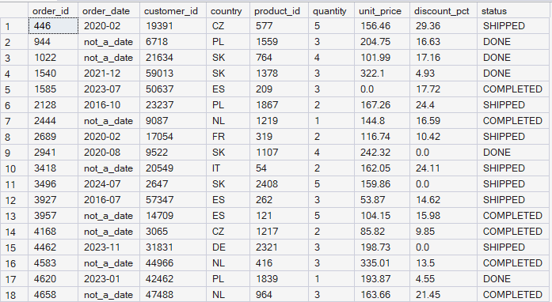

**_Screen 34: checking the correlation between the ____-__ and not_a_date data formats and the rest of the data_**

Unfortunately, I didn't find any pattern to the occurrence of this data that would let me determine why it was recorded this way, or find any pattern to its occurrence. Next, I check with the query below how many records have these types of dates, so I can decide what to do with them.

```sql
SELECT count(*) AS number
FROM sales_orders
WHERE order_date LIKE '____-__'; 
```

```sql
SELECT count(*) AS number
FROM sales_orders
WHERE order_date LIKE 'not_a_date'; 
```

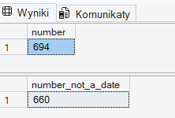

**_Screen 35: Number of records for order_date with the ____-__ format and not_a_date_**

The screen above shows that there are 694 records in the ____-__ format, which is 0.3% of the data. For not_a_date, there are 660, also 0.3%. Since this amount of data is below 1%, I believe the best solution is to remove them.
Since at such a low rate their removal doesn't significantly affect the analysis results, because:

The scale is negligible: losing under 1% of rows doesn't disturb distributions, sums, or averages in a statistically noticeable way.

Imputation adds no real value: trying to fill in these records (e.g. with a mean or median) would create data that never actually occurred, introducing artificial, potentially misleading information into the dataset.

Simplicity and transparency: removal is easy to explain and justify (e.g. to a manager or a client), unlike "inventing" values.

The benefit outweighs the cost: the effort of imputation isn't justified given such a marginal impact on the final result.

If the share of missing data were much higher (e.g. 20-30%), removal would start to genuinely distort the picture of the data and would require a different approach (e.g. imputation or flagging the records).

I remove the data with the following query:

```sql
DELETE FROM sales_orders
WHERE order_date LIKE '____-__'
OR order_date = 'not_a_date';
```

As a result of this operation, 1,354 rows were removed. I confirm with the command below that the records were indeed removed:

```sql
SELECT *
FROM sales_orders
WHERE order_date LIKE '____-__'
 OR order_date = 'not_a_date';
```

After running the query, I got an empty table, so all the unwanted records were removed. Now I move on to standardizing the date formats.

First, I check whether there's any unusual date format I haven't noticed yet. I use the query below to check this:

```sql
SELECT order_date
FROM sales_orders
WHERE order_date NOT LIKE '__/__/____'
	AND order_date NOT LIKE '__-__-____' 
	AND order_date NOT LIKE '____/__/__'
	AND order_date NOT LIKE '____.__.__'
	AND order_date NOT LIKE '__.__.____'
	AND order_date NOT LIKE '____-__-__';
```

After running the query, I got an empty table, which means no format other than the ones already listed occurs. I wanted to check whether the order_date column might hide dates written in the American format rather than only the European one (since that could cause problems when converting the dates).

The idea was: if the first pair of digits is 01-12 (so it could be a month), and the second pair of digits is greater than 12 (so it definitely can't be a month, since there are only 12 months), then I can be 100% sure it's the American format, since that would be impossible in the European one.

```sql
	SELECT order_date, SUBSTRING(order_date,1,2) AS first_pair, SUBSTRING(order_date,4,2) AS second_pair
	FROM sales_orders
	WHERE (order_date LIKE '__/__/____' AND SUBSTRING(order_date,1,2) < '13' AND SUBSTRING(order_date,4,2) > '12')
 OR (order_date LIKE '__.__.____' AND SUBSTRING(order_date,1,2) < '13' AND SUBSTRING(order_date,4,2) > '12')
 OR (order_date LIKE '__-__-____' AND SUBSTRING(order_date,1,2) < '13' AND SUBSTRING(order_date,4,2) > '12');
```

The query result showed 0 records that would 100% match the American format. This isn't airtight proof: in theory there could be records like 05/03/2024, where both numbers are ≤ 12 and you can't tell from the digits alone whether it's the day or the month; I'm not able to catch such cases with this method. Even so, since not a single certain case of the American format turned up among 258,017 records, this is a strong signal that I can assume all the dates in this column are in the European format. I treat this as a deliberate decision based on data analysis, not something I overlooked.

Next, in order to standardize the date format in the order_date column to a single pattern (YYYY-MM-DD), I first checked what the data would look like after the transformation, without making any changes yet. I used a SELECT query with CASE conditions that recognizes three different input formats based on the character pattern (__/__/____, __-__-____, ____/__/__) and converts each of them to the uniform YYYY-MM-DD form, using SUBSTRING to pull the day, month, and year out of the appropriate positions in the text. Records that didn't match any of the recognized patterns were left unchanged (ELSE order_date), so I could verify them separately later.

```sql
SELECT order_date,
 CASE
 WHEN order_date LIKE '__/__/____'
	THEN SUBSTRING (order_date, 7,4) + '-'
 + SUBSTRING (order_date, 4,2) + '-'
 + SUBSTRING (order_date, 1,2)
WHEN order_date LIKE '__-__-____'
	THEN SUBSTRING (order_date, 7,4) + '-'
 + SUBSTRING (order_date, 4,2) + '-'
 + SUBSTRING (order_date, 1,2)
WHEN order_date LIKE '____/__/__'
	THEN SUBSTRING (order_date, 1,4) + '-'
 + SUBSTRING (order_date, 6,2) + '-'
 + SUBSTRING (order_date, 9,2)
ELSE order_date
END
FROM sales_orders;
```

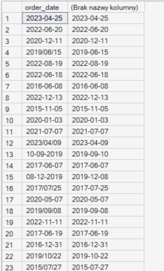

**_Screen 36: Working check of what the date format change looks like_**

For standardization, I chose the YYYY-MM-DD format, since it matches the ISO 8601 standard, an international standard for writing dates, widely used in databases and information systems regardless of country or language. An added benefit of this format is that it sorts correctly as plain text (chronologically ascending) without needing an extra conversion to a date type, unlike, for example, the DD/MM/YYYY format, where alphabetical sorting doesn't match chronological order.

After confirming that the preview result looked correct, I applied the same logic in an UPDATE to actually overwrite the values in the table.

```sql
UPDATE sales_orders
SET order_date = CASE
WHEN order_date LIKE '__/__/____'
	THEN SUBSTRING (order_date, 7,4) + '-'
 + SUBSTRING (order_date, 4,2) + '-'
 + SUBSTRING (order_date, 1,2)
WHEN order_date LIKE '__-__-____'
	THEN SUBSTRING (order_date, 7,4) + '-'
 + SUBSTRING (order_date, 4,2) + '-'
 + SUBSTRING (order_date, 1,2)
WHEN order_date LIKE '____/__/__'
	THEN SUBSTRING (order_date, 1,4) + '-'
 + SUBSTRING (order_date, 6,2) + '-'
 + SUBSTRING (order_date, 9,2)
WHEN order_date LIKE '____.__.__'
	THEN SUBSTRING(order_date, 1, 4) + '-'
 + SUBSTRING(order_date, 6, 2) + '-'
 + SUBSTRING(order_date, 9, 2)
ELSE order_date
END; 
```

During this step I noticed an additional format I hadn't accounted for in the original query: YYYY.MM.DD (periods instead of hyphens or slashes), so I added a separate WHEN condition for it before running the UPDATE. 258,017 records were changed.

Finally, to confirm the operation succeeded and no records were left in the old formats, I ran a verification query: SELECT DISTINCT order_date with a WHERE condition checking all the patterns recognized so far (including the ____.__.__ format found along the way, plus __.__.____ just in case the same separator also occurred in a day-month-year layout). This step lets me be confident that no record "slipped through" unnoticed in a different format.

```sql
SELECT DISTINCT order_date
FROM sales_orders
WHERE order_date LIKE '__/__/____'
	OR order_date LIKE '__-__-____' 
	OR order_date LIKE '____/__/__'
	OR order_date LIKE '____.__.__'
	OR order_date LIKE '__.__.____'; 
```

After running the query, I got an empty table, which means the verification was successful.

Next, I moved on to the quantity and unit_price columns

In the quantity column, there are orders with a quantity of 0 where a price is given and the order status is marked as, among others, completed or done. This suggests some kind of error in data collection. First, I wanted to see whether I could spot any pattern between quantity = 0 and the rest of the columns

```sql
SELECT *
FROM sales_orders
WHERE quantity = 0; 
```

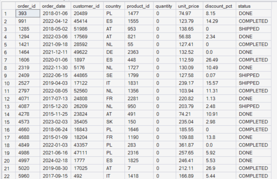

**_Screen 37: looking for connections between quantity = 0 and the rest of the columns_**

Unfortunately, I didn't find any connection between quantity = 0 and the rest of the columns

Since there was no visible pattern linking quantity = 0 to the rest of the columns, I checked how these records are distributed across the different order statuses: whether quantity = 0 is tied to one particular status (which could explain the error), or occurs across all of them.

```sql
SELECT status, COUNT(*) AS number
FROM sales_orders
WHERE quantity = 0
GROUP BY ROLLUP (status)
```

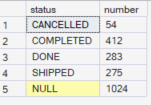

**_Screen 38: number of records with quantity = 0 broken down by status, with a grand total (ROLLUP)_**

Records with quantity = 0 appear across all statuses, including "completed" and "shipped", which confirms that this isn't logical business behavior (an order with a quantity of zero can't be fulfilled and shipped), only a data error. In total there are 1,024 such records out of 258,793, or 0.4% of the whole dataset. Given such a small share and the lack of any reliable way to reconstruct the correct quantity value, I decided to remove them.

```sql
DELETE FROM sales_orders
WHERE quantity = 0
SELECT MIN(quantity) AS min, MAX(quantity) AS max
FROM sales_orders
```

1,028 rows were removed.

Finally, to make sure no other unusual values remained in the quantity column (e.g. fractional ones like 0.2 or 0.6, which wouldn't make sense for a count of items), I checked its minimum and maximum values.

1,028 rows were removed.

Finally, to make sure no other unusual values remained in the quantity column (e.g. fractional ones like 0.2 or 0.6, which wouldn't make sense for a count of items), I checked its minimum and maximum values.

```sql
SELECT MIN(quantity) AS min, MAX(quantity) AS max
FROM sales_orders
```

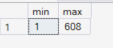

**_Screen 39: minimum and maximum values in the quantity column after removing the zeros_**

The result confirms that the values are valid, with no fractions and no new outliers.

Following the same approach as with quantity, I checked the unit_price column for zero values. Since unit_price is stored as text, I used TRY_CAST(unit_price AS decimal(10,2)) = 0 to safely compare it with a number.

```sql
SELECT *
FROM sales_orders
WHERE TRY_CAST(unit_price AS decimal(10,2)) = 0
```

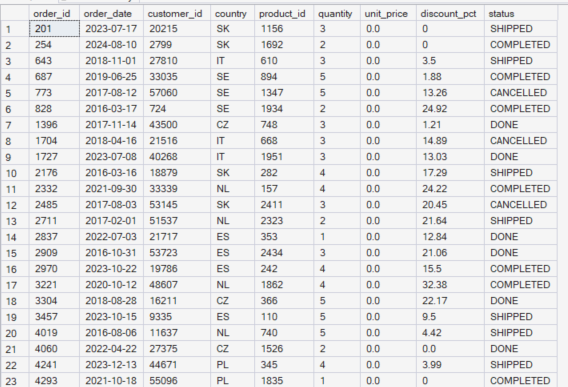

**_Screen 40: records with unit_price = 0_**

These records occur across various orders, products, and statuses. It's unlikely that they represent free items, especially since some of them also have a discount applied, which wouldn't make sense at a price of zero. I also checked the distribution of these records by order status:

```sql
SELECT status, COUNT(*)
FROM sales_orders
WHERE TRY_CAST(unit_price AS decimal(10,2)) = 0
GROUP BY ROLLUP (status);
```

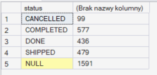

**_Screen 41: number of records with unit_price = 0 broken down by status_**

Just as with quantity = 0, these records occur across all statuses, including "completed" and "shipped", which again points to a data error rather than logical business behavior. In total I found 1,591 such records out of 256,993 records in the table (after the earlier removal of the quantity = 0 cases), which is 0.6% of the dataset. Given such a small share and the lack of any reliable way to reconstruct the correct price, I decided to remove them.

```sql
DELETE FROM sales_orders
WHERE TRY_CAST(unit_price AS decimal(10,2)) = 0
```

Finally, I checked the number of rows remaining in the table to confirm that the operation removed exactly as many records as it should have.

```sql
SELECT COUNT(*)
FROM sales_orders;
```

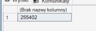

**_Screen 42: number of records in the sales_orders table after data cleaning_**

The row count decreased by 1,591, as expected.

#### Summary

Cleaning the sales_orders table covered five main areas: missing data, duplicates, inconsistent naming, date formats, and zero values in quantity and unit_price.

Null values. I found no correlation between the gaps and other columns. I removed the nulls in order_date (629 rows, 0.2%), too small a share to affect the analysis. I replaced the nulls in discount_pct (31,243 rows, 12%) with 0 instead of removing them, since they made up too large a part of the dataset, and the most likely interpretation of a missing value is that no discount was applied.

Duplicates. In the order_id column I found 780 fully duplicated rows (not just the order number, but entire records). I removed them using ROW_NUMBER() with PARTITION BY order_id, keeping exactly one copy of each order.

Standardizing naming. I unified the order status to three uppercase values (SHIPPED, COMPLETED, DONE), and the country names to ISO 3166-1 alpha-2 codes (e.g. DE, CZ, PL) instead of arbitrary text variants.

Date format. In the order_date column I removed records in unrecognizable formats (____-__ and not_a_date, 1,354 rows in total, 0.6%), confirmed that no dates were written in the American format, and then standardized all the remaining dates to the YYYY-MM-DD format (compliant with ISO 8601).

Zero values. I removed records with quantity = 0 (1,028 rows, 0.4%) and unit_price = 0 (1,591 rows, 0.6%). In both cases, the zeros occurred across all order statuses (including completed and shipped), which pointed to a data error rather than logical business behavior.

All decisions to remove records were backed by a low rate of missing data (under 1% in every case) and the lack of a reliable way to reconstruct the correct values.

After all the cleaning operations, 255,402 rows remain in the sales_orders table (out of the original 260,780), meaning 5,378 records were removed in total, about 2.1% of the starting dataset.

### Table products

The next step is to start cleaning the data in the products_mmmgmeum table. From the earlier analysis, I know that:

- The table contains 2,500 rows and 5 columns: product_id, category, sub_category, base_price, launch_date: text, numeric, and date data.

- Null values occur only in the launch_date column: 91 values (3.64%), a share small enough that it shouldn't significantly affect the analysis.

- product_id is fully unique, no duplicates.

- category contains 5 consistently named categories, every row has a value assigned.

- sub_category contains 22 consistently named subcategories, with no gaps in assignment.

- base_price has no values below 0.01 and no suspicious minimum/maximum values, the data is considered correct.

- launch_date, besides the null gaps, also contains non-standard entries: dates without a day and entries with the text not_a_date. To be resolved at the data cleaning stage (fill in or remove).

#### Null values

First, I check whether I notice any correlation between the null values in the launch_date column and the rest of the columns, with the following query:

```sql
SELECT *
FROM products_mmmgmeum
WHERE launch_date is NULL;
```

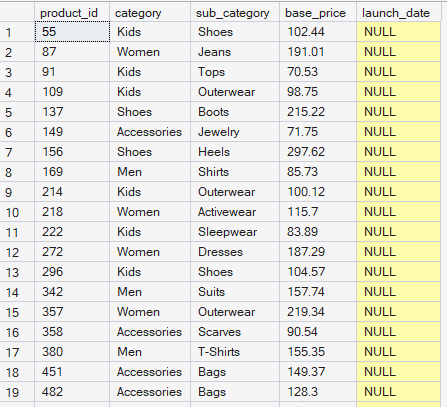

**_Screen 43: Looking for a correlation between the nulls in the launch_date column and the other values_**

I don't find any correlation between these values; I haven't noticed them repeating for a given category or sub_category. Since there are 91 such records in total, and null values make up 3.64%, I decide to remove them, since it won't affect the further analysis. I carry out the removal with the following query:

```sql
DELETE FROM products_mmmgmeum
WHERE launch_date is NULL;
```

As a result, 91 rows were removed.

Next, I look in the same column for dates in the wrong format. I do this with the following command:

```sql
SELECT launch_date, COUNT (*) AS how_many_wrong_date
FROM products_mmmgmeum
WHERE launch_date LIKE '____-__' 
 OR launch_date LIKE '____/__' 
 OR launch_date LIKE 'not_a_date'
GROUP BY launch_date
ORDER BY how_many_wrong_date
```

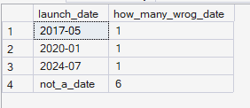

**_Screen 44: Looking for incomplete dates in the launch_date column_**

Only 9 rows have incomplete dates. Since this is a very small share, I decide to remove them

```sql
DELETE FROM products_mmmgmeum
WHERE launch_date LIKE '____-__' 
 OR launch_date LIKE '____/__' 
 OR launch_date LIKE 'not_a_date';
```

#### Standardizing the date format

As a result of the command, 9 records were removed. Now I move on to unifying the formatting in the launch_date column. Just as with order_date, I first check as a preview what the data will look like after the transformation, before permanently overwriting it.

```sql
SELECT launch_date,
CASE 
WHEN launch_date LIKE '__-__-____'
THEN SUBSTRING(launch_date, 7, 4) + '-' 
+SUBSTRING(launch_date, 4, 2) + '-' 
+SUBSTRING(launch_date, 1, 2) 
WHEN launch_date LIKE '__/__/____' 
THEN SUBSTRING(launch_date, 7, 4) + '-' 
+SUBSTRING(launch_date, 4, 2) + '-' 
+SUBSTRING(launch_date, 1, 2) 
WHEN launch_date LIKE '__.__.____' 
THEN SUBSTRING(launch_date, 7, 4) + '-' 
+SUBSTRING(launch_date, 4, 2) + '-' 
+SUBSTRING(launch_date, 1, 2) 
WHEN launch_date LIKE '____/__/__' 
THEN SUBSTRING(launch_date, 1, 4) + '-' 
+SUBSTRING(launch_date, 6, 2) + '-' 
+SUBSTRING(launch_date, 9, 2) 
WHEN launch_date LIKE '____.__.__' 
THEN SUBSTRING(launch_date, 1, 4) + '-' 
+SUBSTRING(launch_date, 6, 2) + '-' 
+SUBSTRING(launch_date, 9, 2) 
ELSE launch_date 
END AS new_launch_date
FROM products_mmmgmeum;
```

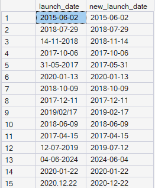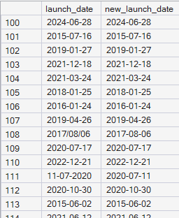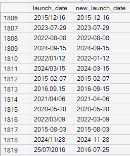

**_Screen 45: Preview of the launch_date column before and after unifying the format_**

After confirming that the preview was correct, I applied the same logic in an UPDATE to permanently overwrite the values in the table.

```sql
UPDATE products_mmmgmeum
SET launch_date = CASE
WHEN launch_date LIKE '__-__-____'
THEN SUBSTRING(launch_date, 7, 4) + '-'
+SUBSTRING(launch_date, 4, 2) + '-'
+SUBSTRING(launch_date, 1, 2)
WHEN launch_date LIKE '__/__/____'
THEN SUBSTRING(launch_date, 7, 4) + '-'
+SUBSTRING(launch_date, 4, 2) + '-'
+SUBSTRING(launch_date, 1, 2)
WHEN launch_date LIKE '__.__.____'
THEN SUBSTRING(launch_date, 7, 4) + '-'
+SUBSTRING(launch_date, 4, 2) + '-'
+SUBSTRING(launch_date, 1, 2)
WHEN launch_date LIKE '____/__/__'
THEN SUBSTRING(launch_date, 1, 4) + '-'
+SUBSTRING(launch_date, 6, 2) + '-'
+SUBSTRING(launch_date, 9, 2)
WHEN launch_date LIKE '____.__.__'
THEN SUBSTRING(launch_date, 1, 4) + '-'
+SUBSTRING(launch_date, 6, 2) + '-'
+SUBSTRING(launch_date, 9, 2)
ELSE launch_date
END
```

2,400 records were changed

Finally, to make sure the operation ran correctly and no records were left in the old format, I ran a verification query:

```sql
SELECT DISTINCT launch_date 
FROM products_mmmgmeum 
WHERE launch_date NOT LIKE '____-__-__';	
```

The query returned an empty table, which confirms that all the dates in the launch_date column were correctly unified to the YYYY-MM-DD format.

To wrap up the work on the products_mmmgmeum table, I finally checked the total number of remaining rows:

```sql
SELECT COUNT(*) 
FROM products_mmmgmeum;
```

The result confirmed 2,400 rows remaining in the table.

#### Summary

I checked the correlation between the null values in launch_date and the other columns (category, subcategory); I found no pattern.

I removed 91 rows with a null value in launch_date (3.64% of the dataset), too small a share to affect the further analysis.

Among the remaining data I found 9 records with incomplete or invalid dates (formats missing a day, and not_a_date entries), and I removed those too.

I unified the remaining dates to the YYYY-MM-DD format, handling five different input formats (hyphens, slashes, periods, in both day-first and year-first layouts).

I verified the result with a query checking for any dates outside the target format. It returned an empty table, which confirms full standardization.

Final row count in the table: 2,400 (out of the original 2,500; 100 records were removed in total: 91 nulls plus 9 invalid formats).

### Table inventory

Finally, we're left with the INVENTORY table. From the earlier analysis, we know that:

- the table has 4 columns (product_id, warehouse_country, stock_quantity, last_stock_update), containing text, numeric, and date data.

- Null values occur only in the last_stock_update column, there are 26 of them, 0.7% of the dataset, and I'll decide what to do with them at the data cleaning stage.

- The product_id and stock_quantity columns raise no concerns. No negative or non-numeric values.

- The only real problem is inconsistent country naming in the warehouse_country column (e.g. DE vs Germany), similarly to the sales_orders table, along with the null values in last_stock_update; these two things will need attention during data cleaning.

- The date format in last_stock_update is already uniform (YYYY-MM-DD), so this column doesn't need additional standardization.

#### Standardizing country names

First, I standardized the naming of countries in the warehouse_country column. I did this the same way as before for sales_orders, deciding to use ISO 3166-1 alpha-2 codes (DE, PL, CZ). The column had the same problem as before: many variants for writing the same country, e.g. Germany, germany, GER, Deutschland. The ISO code used gives one unambiguous identifier independent of language and letter case, which makes further grouping of the data and any joining with external sources (e.g. Eurostat) easier.
I used the following command to unify the formats:

```sql
UPDATE inventory_mmmgkubv
SET warehouse_country = 'DE'
WHERE warehouse_country IN ('Germany', 'germany','GER', 'Deutschland');
```

```sql
UPDATE inventory_mmmgkubv
SET warehouse_country = 'PL'
WHERE warehouse_country IN ('Polska', 'pl', 'poland', 'Poland', 'POL');
```

```sql
UPDATE inventory_mmmgkubv
SET warehouse_country = 'CZ'
WHERE warehouse_country IN ('Czech', 'Czech Republic', 'Czechia');
```

As a result of these three operations, the following were changed: 975 rows for Germany, 1,270 rows for Poland, and 1,019 rows for Czechia. Finally, I checked whether any overlooked variants or abbreviations remained anywhere:

```sql
SELECT DISTINCT warehouse_country 
FROM inventory_mmmgkubv;
```

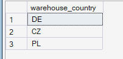

**_Screen 46: Unique values in the warehouse_country column after standardization_**

As shown in screen 46, there are now only 3 countries, and all of them use the ISO 3166-1 alpha-2 code

#### Null values

Next, I dealt with the null values in the last_stock_update column. First, I checked whether there was any correlation between the null values and the rest of the columns. I did this with the following query:

```sql
SELECT *
FROM inventory_mmmgkubv
WHERE last_stock_update IS NULL;
```

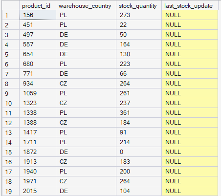

**_Screen 47: Null values in last_stock_update_**

I found no relationship between the null values in last_stock_update and the rest of the columns. Since null values make up only 0.7%, I decide to remove them, since removing such a small number of records shouldn't affect the further analysis.

I removed these records with the following query:

```sql
DELETE FROM inventory_mmmgkubv
WHERE last_stock_update IS NULL;
```

As a result, 26 rows were removed.

#### Summary

As a result of data cleaning, the country names in warehouse_country were standardized to ISO codes (DE, PL, CZ), the same way as in sales_orders, and I removed 26 records (0.7%) with a missing date in last_stock_update, with no correlation found to other columns. The rest of the table (product_id, stock_quantity, date format) needed no intervention.

### Summary of the data cleaning process

Data cleaning covered three tables: sales_orders, products, and inventory. The work focused on five recurring types of problems: missing data (nulls), duplicates, inconsistent text naming, non-standard date formats, and zero values inconsistent with business logic. In every case, the decision to remove, fill in, or standardize records was preceded by checking whether the problem correlated with other columns, and by checking what share of the data it actually affected. Only gaps that made up a few percent of the dataset and had no reliable way of being reconstructed were removed. Country naming in both tables where it occurred (sales_orders and inventory) was unified to ISO 3166-1 alpha-2 codes, and all dates (order_date, launch_date, last_stock_update) were brought to the YYYY-MM-DD format compliant with ISO 8601. After cleaning, the sales_orders table has 255,402 rows (out of the original 260,780), products has 2,400 rows (out of the original 2,500), and inventory has 3,715 rows (out of the original 3,741), with unified country naming and the gaps in the last stock update date removed. The data in this state is ready for further business analysis.

'---'

### Recommendations for the Data Collection Team

- **Unify the order status dictionary.** The same status is currently recorded in several different ways (e.g. SHIP/Shipped, complete/Completed). A closed list of allowed values (e.g. a dropdown in the source system) should be introduced instead of a free-text field. This matters because inconsistent recording forces every analyst to manually map the variants before any analysis can begin, which costs time and increases the risk of missing one of the variants.

- **Unify country name recording.** The same countries appear under many different names and abbreviations (e.g. DE, Germany, Deutschland, GER). A fixed list of ISO 3166-1 alpha-2 codes should be introduced already at the data entry stage. This will make it possible to correctly group sales and inventory data by country, instead of requiring every report to re-clean the same data from scratch.

- **Standardize the date format.** Dates appear in several different formats (DD/MM/YYYY, MM/DD/YYYY, YYYY.MM.DD, and others), which increases the risk of misinterpretation (e.g. confusing the day with the month). A single format should be enforced (ideally YYYY-MM-DD, compliant with ISO 8601) directly in the data entry form or system. This matters because confusing the day with the month during date conversion can silently introduce incorrect values into the analysis, with no error message at all.

- **Investigate the cause of duplicated orders.** 780 fully duplicated rows were found in the sales_orders table, pointing to a system error (most likely the same order being recorded twice). The recording logic on the source system side should be reviewed. This is very important, since undetected duplicates artificially inflate revenue and order counts in every report based on this data.

- **Review the validation of the quantity and unit_price fields.** Records were found with a quantity or price of 0 alongside statuses suggesting a completed order (e.g. completed, shipped), which makes no business sense. Validation should be added to prevent this combination from being saved. This kind of error can point to a deeper problem in the sales process (e.g. system integration errors), not just isolated data entry mistakes.

- **Reduce the occurrence of missing data (nulls).** Several columns (order_date, discount_pct, launch_date, last_stock_update) contain empty values. It should be established whether a field is required, and this should be enforced at the form or system level, rather than allowing it to be skipped. The lack of a clear rule about whether a field is mandatory creates ambiguity: it's unclear whether an empty value means missing data, an error, or a deliberate choice (e.g. no discount applied).

- **Synchronize the stock update date with the order date.** Discrepancies between these two dates make it difficult to reliably analyze inventory levels; an automatic update on every transaction should be considered. This matters because, without this synchronization, it's impossible to reliably assess whether a given product was actually in stock at the time of sale.

